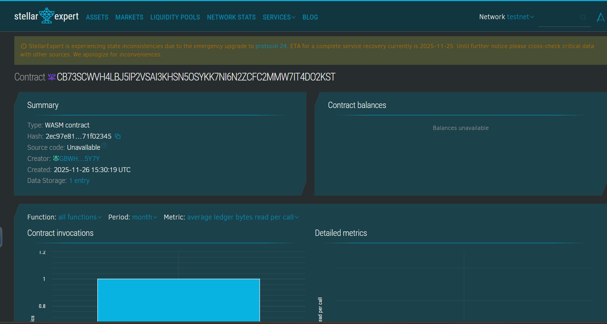

# SecureTender Hub

## Project Title
SecureTender Hub

## Project Description
SecureTender Hub is a blockchain-powered platform for submitting sealed tenders where company bids are stored as cryptographic hashes and revealed only after the deadline. Built with Soroban smart contracts on Stellar, it provides transparent, tamper-proof tender submission and reveal workflows boosting fairness and integrity in procurement.

## Project Vision
This project aims to eliminate premature bid disclosures and unfair competition by enabling sealed tender submissions on immutable ledgers with controlled reveal access. SecureTender Hub fosters trust and auditable fairness in competitive procurement processes leveraging blockchain guarantees.

## Key Features
- Sealed Tender Submission: Cryptographic bid hashes are securely stored on-chain.
- Controlled Reveal: Bids revealed publicly only after the tender deadline.
- Authorization Controls: Only submitting companies can reveal their bids.
- Immutable Records: Tender submissions and reveals are permanently recorded.
- Tamper-proof Process: Prevents bid manipulation or early access.
- Public Query: Anyone can audit tender statuses and revealed bids post-deadline.
- Off-chain Hash Verification: Ensures original bid data validity.

## Usage Instructions
1. Companies submit tenders comprising bid hash data before deadline.
2. After tender closing, companies reveal their bids by unveiling original data.
3. Tender statuses and details are transparently available for auditing.
4. Procurements use revealed bids for evaluation and award decisions.

## Future Scope
- Fully on-chain hash verification using WASM modules.
- Multi-stage tender workflows with negotiation and clarifications.
- Integration with digital identity providers for company authentication.
- Support for multi-criteria and weighted bidding.
- Interfaces for procurement officers and bidders.
- Escrow and automated payment/penalty enforcement.

## Technology Stack
- Soroban Rust SDK for secure contract logic.
- Stellar blockchain facilitating decentralized ledger and timing.
- Cryptography supporting hashing and identity verification.

## Contribution
Welcomes developers, procurement specialists, and blockchain enthusiasts to contribute enhancements and audits. Fork and submit pull requests.

## License
This project is licensed under the MIT License.

### Contract Detail
ID : CB73SCWVH4LBJ5IP2VSAI3KHSN5OSYKK7NI6N2ZCFC2MMW7IT4DO2KST
